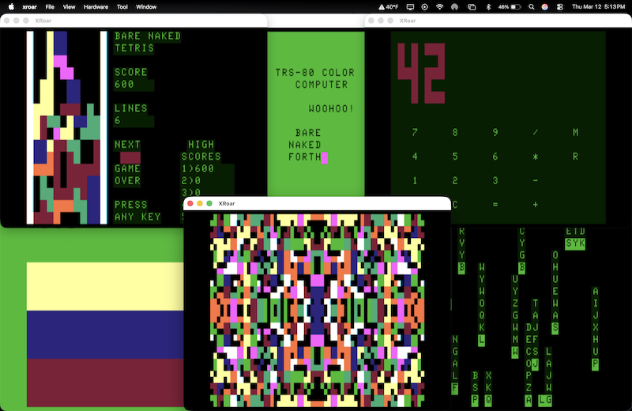

# Bare Naked Forth — Modern Bytecode for the Color Computer

A cross-compiled Forth toolchain for the TRS-80 Color Computer. Write Forth
on a modern machine. Run it natively on the CoCo's 6809.



---

## How it works

No interpreter sitting between you and the metal. Your Forth compiles to threaded code on a modern machine and runs at full 6809 speed on the CoCo.

```
source.fs  →  fc.py (cross-compiler)  →  DECB binary  →  CoCo 6809
```

The kernel is a minimal ITC Forth executor written in 6809 assembly. It
implements the inner interpreter and a set of primitives. Everything else —
applications, games, tools — is cross-compiled Forth bytecode that the kernel
executes natively. The CoCo never sees source text.

---

## What's here

A kernel, a compiler, a tutorial, and a growing library of programs that prove it all works.

| Path | What it is |
|---|---|
| `forth/kernel/kernel.asm` | 6809 ITC Forth executor kernel |
| `forth/tools/fc.py` | Forth cross-compiler (source → DECB binary) |
| `forth/hello/hello.fs` | Hello World — the first application |
| `forth/run.sh` | One-command build and run script |
| `forth/kernel/README.md` | Kernel architecture, primitives, memory layout |
| `forth/tools/README.md` | Cross-compiler internals and usage |
| `forth/lib/` | Shared Forth libraries (RNG, screen, printing) |
| `src/tetris/` | Bare Naked Tetris — SG4 semigraphics game |
| `src/kaleidoscope/` | Kaleidoscope — SG4 symmetric pattern generator |
| `src/calculator/` | RPN calculator |
| `src/spacewarp/` | Space Warp — real-time space combat game with genome-driven AI |
| `docs/` | Tutorial book: *Getting Started with Bare Naked Forth* |
| `docs/reference.html` | [Language Reference](docs/reference.html) — all words, stack effects, and memory map |
| `COCO_RENOVATION.md` | Original vision document |
| `coco_technical_reference.pdf` | TRS-80 CoCo technical reference |

---

## Quick start

From zero to "HELLO, WORLD!" on a CoCo 2 screen in under a minute.

Requires `lwtools` and `xroar` (`brew install lwtools xroar`). CoCo 2 ROM
images (`bas12.rom`, `extbas11.rom`) in `~/.xroar/roms/`.

```sh
cd forth
./run.sh hello/hello.fs
```

That builds the kernel (once), cross-compiles `hello.fs`, and launches XRoar
with the result. "HELLO, WORLD!" appears on a CoCo 2 screen.

To run any Forth program:

```sh
./run.sh path/to/program.fs
```

---

## Status

The foundation is solid. The kernel boots, the compiler works, and real programs run on real (emulated) hardware.

Working: kernel boots, clears screen, executes cross-compiled Forth bytecode.
All 13 tutorial chapters complete with working example programs.
Space Warp (src/spacewarp/) — a full real-time space combat game with procedural AI, artifact-color graphics, and 51 kernel primitives.

### Kernel primitives

| Group | Words |
|---|---|
| Threading | DOCOL, DOVAR, EXIT, LIT |
| Stack | DUP, DROP, SWAP, OVER, ?DUP, 2DUP, 2DROP, ROT |
| Arithmetic | +, -, \*, /MOD, NEGATE, MIN, MAX, ABS |
| Memory | @, !, C@, C!, FILL, CMOVE, +! |
| Bitwise | AND, OR, LSHIFT, RSHIFT |
| I/O | EMIT, CR, KEY, KEY?, KBD-SCAN |
| Control flow | 0BRANCH, BRANCH, DO, LOOP, I |
| Comparison | =, <>, <, >, 0= |
| Return stack | >R, R>, R@ |
| Screen | AT |
| String | TYPE, COUNT |
| Spatial | PROX-SCAN, MDIST |
| Data | sprite-data, font-data |
| System | HALT |

### Cross-compiler (fc.py)

| Feature | Status |
|---|---|
| Literals, word calls | done |
| Colon definitions, EXIT | done |
| VARIABLE, @, ! | done |
| CHAR | done |
| DO, LOOP, I | done |
| IF, ELSE, THEN | done |
| BEGIN, AGAIN, UNTIL | done |
| Constants (CONSTANT) | done |
| INCLUDE | done |
| CODE ... ;CODE (inline 6809 assembly) | done |
| S" (string literals), ." (print string) | done |

---

## Tutorial

Thirteen chapters take you from your first stack push to a working game running on vintage hardware. No prior Forth or 6809 experience needed.

`docs/` contains *Getting Started with Bare Naked Forth* — a 13-chapter beginner's
book. Each chapter has a working example program and DIY exercises.

| # | Chapter | Concepts |
|---|---------|----------|
| 1 | Meet Your Stack | stack, EMIT, HALT, CHAR |
| 2 | Say Something | colon definitions, CR |
| 3 | Make Your Own Words | building a vocabulary |
| 4 | The Stack Is Your Friend | DUP, DROP, SWAP, OVER |
| 5 | Remember Things | VARIABLE, @, ! |
| 6 | Count and Loop | DO, LOOP, I |
| 7 | Decisions | IF, ELSE, THEN, comparisons |
| 8 | Read the Keyboard | KEY, interactive programs |
| 9 | Numbers on Screen | \*, /MOD, printing numbers |
| 10 | The Calculator | BEGIN…AGAIN, RPN calculator |
| 11 | Anywhere on Screen | AT, fixed screen layouts |
| 12 | The Guessing Game | a complete interactive game |
| 13 | Getting It onto Your CoCo | CoCoSDC, DriveWire, cassette |

Open `docs/index.html` in a browser to read it locally.

---

## Roadmap

### Space Warp v1.0 — April 15, 2026

The flagship application. A real-time space combat game with procedural AI,
artifact-color graphics, and Trek-inspired tactical depth. Core gameplay is
complete. The v1.0 sprint focuses on combat balance and dramatic feel.

Design informed by reverse engineering of the original Z80 Space Warp (1979)
and tactical analysis of Star Trek TOS combat doctrine. Full comparison in
`src/spacewarp/COMBAT_ANALYSIS.md`.

**v1.0 release targets:**
1. Fix BEAM-PATH buffer corruption (#290) — game-breaking bug
2. Reclaim ~120 bytes through code factoring
3. Combat rebalance (the core gameplay improvement):
   - Maser range-dependent damage — primary weapon, devastating close (#312)
   - Missile damage nerf to 60-80 — finisher, not primary (#313)
   - Jovian aim scatter by pilot skill — genome matters in combat (#314)
   - Damage spread across 2-3 systems per hit — ship rusts under fire (#315)
   - Shield bleedthrough below 40% — TOS dramatic arc (#306)
4. Bug fix: starbase gravity spawn (#233)

**Post-v1.0 combat features** (prioritized):
- SOS timer system with escalating messages (#317, #319)
- Finite base missile supply — campaign resource anxiety (#318)
- Direct hit bonus — center-distance damage scaling (#316)
- Spacebar quick-fire masers for dogfighting (#320)
- Status line micro-reports — TOS bridge crew flavor (#321)
- Crew count, casualties, and score (#322)
- Non-linear repair — field cap at 50-60%, dock required below 25% (#309)
- Friendly fire on starbases (#323)
- Smart Jovian missile evasion (#183)
- Directional Endever sprites (#324)
- Permanent damage accumulation (#325)

**Sprite evaluation tools** (complete):
- Visual tuning harness, SVG catalog, and mobile rater app for evaluating
  all 256 procedural Jovian sprite patterns. See `src/spacewarp/SPRITE_RATER.md`.

### Platform

Where this goes next — from software-only to cartridge hardware.

- Serial loader — bit-banged via PIA ($FF20/$FF22) for loading bytecode over RS-232
- ROM cartridge image — kernel + loader burned to flash, bootable from the pak slot
- SD card integration — store and load `.bin` files via CoCoSDC
- RP2350 co-processor — one core on the 6809 bus, the other managing storage and services

---

*This repository — code, documentation, and tutorial — was generated with [Claude](https://claude.ai/) (Anthropic).*
