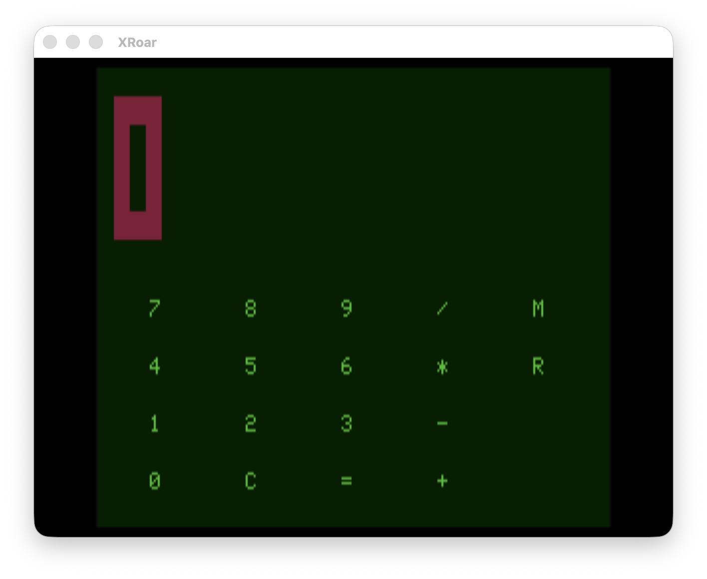

# CoCo Forth Calculator

An infix calculator for the TRS-80 Color Computer, built on the CoCo Forth kernel. Demonstrates VDG semigraphic pixel-font digits, direct video RAM writes, and keyboard input — all in ~130 lines of Forth.



## Screen Layout

```
Col: 0         1         2         3
     01234567890123456789012345678901

Row  0:  (black)
Rows 1-5:  red pixel-font digit display
Row  6:  (black)
Row  7:  (black)
Row  8:  3   9   15  21  27     ← button label columns
         7   8   9   /   M
Row  9:  (black)
Row 10:  4   5   6   *   R
Row 11:  (black)
Row 12:  1   2   3   -
Row 13:  (black)
Row 14:  0   C   =   +
Row 15:  (black)
```

Buttons are single inverse-video characters (green on black). Pressing a key briefly flashes its label to black-on-green before updating the display.

## Key Map

| Key | Action |
|-----|--------|
| `0`–`9` | Enter digit |
| `+` `-` `*` `/` | Set pending operator |
| `=` | Compute result |
| `C` | Clear (reset to 0) |
| `M` | Add display value to memory |
| `R` | Recall memory to display |

## Usage Examples

| Keystrokes | Display |
|------------|---------|
| `3` `+` `4` `=` | 7 |
| `3` `+` `4` `+` `2` `=` | 9 |
| `5` `-` `8` `=` | -3 |
| `5` `M` `3` `+` `R` `=` | 8 |
| `C` | 0 |

## Build

```sh
# 1. Build the kernel
cd forth/kernel && make

# 2. Compile the calculator
python3 forth/tools/fc.py src/calculator/calc.fs \
    --kernel forth/kernel/build/kernel.map \
    --kernel-bin forth/kernel/build/kernel.bin \
    --output src/calculator/calc.bin

# 3. Run in XRoar
xroar -machine coco2bus \
      -bas ~/.xroar/roms/bas12.rom \
      -extbas ~/.xroar/roms/extbas11.rom \
      -kbd-translate \
      -run src/calculator/calc.bin
```

## Known Limitations

- **16-bit signed arithmetic**: numbers are limited to −32768..+32767. Overflow wraps silently.
- **Division is truncating**: remainder is discarded.
- **No decimal point**: integer arithmetic only.

## How It Works

The calculator uses a simple two-value infix model:

1. User enters digits → stored in `ACCUM` (appended as typed)
2. User presses operator → `ACCUM` saved to `PREV`, operator saved to `OP`, fresh entry begins
3. User presses `=` → `DO-OP` computes `PREV op ACCUM`, result in `ACCUM`

Chaining operators (`3 + 4 + 2 =`) works because each operator press first evaluates the pending `PREV op ACCUM`, then saves the result as the new `PREV`.

### Display

The digit display (rows 1–5) uses a hand-coded 3×5 pixel font. Each "pixel" is a VDG SG4 byte `$BF` (solid red semigraphic block) written directly to video RAM. The background is cleared to `$20` (inverse-video space = black) before each redraw.

### VDG encoding

The CoCo VDG in alphanumeric mode:
- `$00`–`$3F`: inverse video — green character on black background
- `$40`–`$7F`: normal video — black character on green background
- `$80`–`$BF`: SG4 semigraphics — colored 2×4 sub-pixel blocks

Button labels use inverse-video bytes (`char & $3F`) for green-on-black. The flash effect swaps to normal-video (`inv_byte + $40`) momentarily to show black-on-green, then restores.
