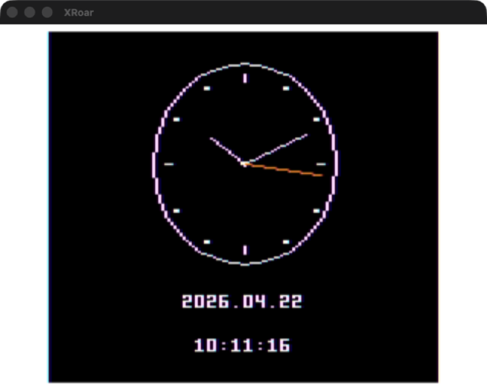

# Clock — Future-Retro Analog + Digital Clock

A wall-clock for the TRS-80 Color Computer that pulls the current time
from a FujiNet's RTC, then sweeps three hands smoothly across an oval
artifact-color face. Every hand glides — proportional to wall-clock
time, no discrete tick events. The minute hand drifts a degree every
~10 seconds; the hour hand a degree every ~2 minutes; the seconds hand
in real time. It's the kind of clock the CoCo always deserved.



## What's on the screen

- **Oval face** — 10% wider than tall to match the CRT's aspect ratio,
  drawn with 24 short line segments for a proper round outline.
- **Quarter ticks** at 12, 3, 6, 9 — short white line segments.
- **Pip markers** at 1, 2, 4, 5, 7, 8, 10, 11 — clean 2×2 squares
  (diagonal 2-pixel ticks never look right at 128×192).
- **Three hands** in z-order hr < mn < sc, each a different length;
  red second hand, white minute and hour hands.
- **Digital readout** below the face: `YYYY.MM.DD` and `HH:MM:SS`.
- **`RTC SYNC` flash** in the upper-right corner when the clock
  re-syncs from the FujiNet (once per minute).

## How time flows

At boot, `sync-from-fn` queries the FujiNet RTC for the current UTC
date/time. From that point on, the clock advances locally — one
`vsync+` per frame increments a sub-second counter, which rolls over
into seconds via an adaptive `vps` (vsyncs-per-second) threshold.

Every minute, at the `:59` boundary, we re-sync from the FujiNet and
let `calibrate-vps` use an EWMA to absorb any drift. On the rare
occasion XRoar can't reach a FujiNet, swap `sync-from-fn` for
`fake-time` in `clock-init` and the clock starts at 10:10:00.

## The smooth-sweep story

The CoCo's 6809 runs at 0.895 MHz and an NTSC field is ~14,917 cycles
of CPU budget per vsync. To keep three hands drifting smoothly with
double-buffering, real-time digital readout, and FujiNet sync — all
while staying under that budget — the clock went through five rounds
of optimization. Each one shaved cycles or eliminated tear conditions.
See [`FRAME_BUDGET.md`](FRAME_BUDGET.md) for the cycle-by-cycle
breakdown and [`frame_budget_chart.html`](frame_budget_chart.html) for
an interactive 60-frame stacked-bar view of where the time goes.

The short version:

| Issue | What changed | Savings |
|-------|--------------|---------|
| #452 | Sec-hand endpoint tables + pixel dedup | -6,400cy/draw |
| #448 | Split render-datetime into date/hm/ss | -6,300cy/sec-change |
| #453 | All three hands smooth-sweep, cascade redraw | smooth motion |
| #454 | Wider oval face + pip ticks | (visual) |
| #455 | Angle math as a single CODE word | -3,660cy/frame |

Post-#455 the typical mid-minute frame uses 22% of budget. Every frame
fits in one vblank except the once-per-day midnight overrun (4 lost
vblanks per day = invisible).

## Build

```sh
# From repo root
make clock-dsk             # builds the kernel + clock, packages CLOCK.DSK

# Or from src/clock/ directly
make                       # builds clock.bin
make run                   # builds + launches XRoar
```

The `clock-dsk` target packages a single-program DSK suitable for the
FujiNet SD card. Mount it on a real CoCo and `LOADM"CLOCK":EXEC`.

## Code map

- [`clock.fs`](clock.fs) — main program (~870 lines)
- [`FRAME_BUDGET.md`](FRAME_BUDGET.md) — full cycle accounting
- [`frame_budget_chart.html`](frame_budget_chart.html) — interactive chart
- [`../../forth/lib/fujinet.fs`](../../forth/lib/fujinet.fs) — FujiNet RTC primitives

The clock uses every part of the Forth kernel: ITC primitives, CODE
words (12 of them, including the unrolled SAM-F page flip and the
all-three-angles math), variables across both buffers, and the kernel
beam-trace/draw/restore pipeline that all the demos share.
